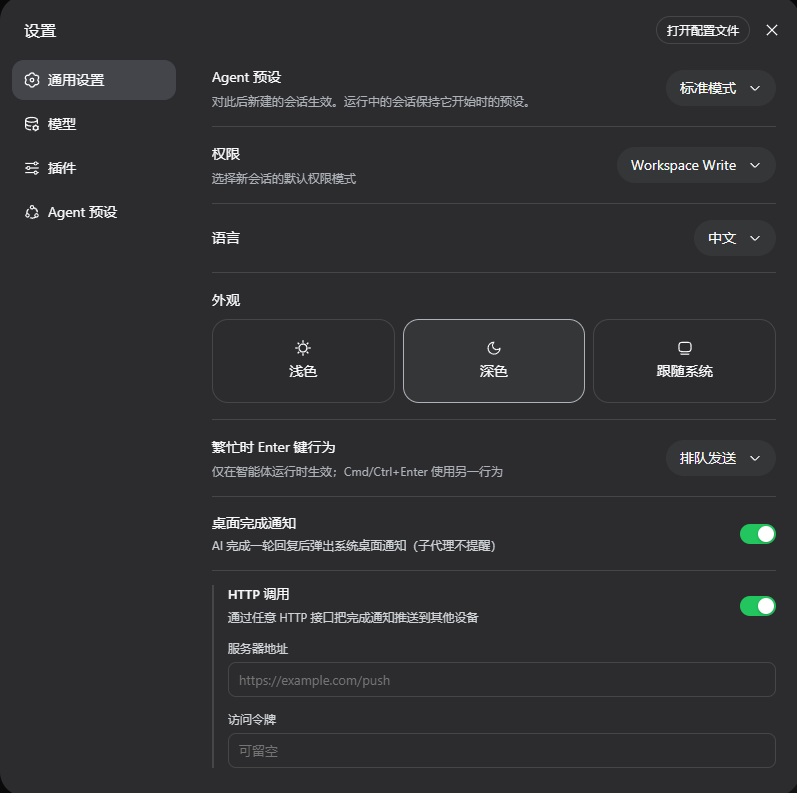

# dsh-desktop-notify

[English](./README_EN.md) | 简体中文

dsh 桌面通知插件：AI 完成回复时弹出系统桌面通知，切走干别的也能第一时间知道。

## 功能

- AI 完成回复时弹出系统原生通知，正文预览回复摘要，并标注工作区 / 会话
- 开关在 dsh 设置 → 通用 →「桌面完成通知」(Desktop Notification on Done)
- 子代理的后台任务完成不弹窗，只提醒主对话
- 支持把完成通知通过 HTTP 接口推送到**多台设备**（手机、其他电脑），每台独立配置、可随意增删

## HTTP 推送（HTTP 调用）

想在你离开电脑时，也在这台电脑之外的其他设备上收到「AI 已完成」提醒，可以开启 HTTP 调用：

1. 准备任意一个能接收 HTTP POST 的服务（自建或任意兼容服务），拿到它的接口地址与（可选）访问令牌。
2. dsh 设置 → 通用 →「桌面完成通知」打开开关，下方会出现「HTTP 调用」，打开它。
3. 点「添加设备」新增一台设备，填入设备名称、服务器地址与访问令牌；可继续添加多台，每台也可单独开关或删除。
4. 离开电脑后，AI 每完成一轮回复，就会向**所有启用且填了地址的设备** `POST` 一条 `{ "title", "body", "token", "icon" }` 的 JSON。

> 桌面通知与 HTTP 调用是两条独立通道：可以只开桌面、只开 HTTP 调用，或两者都开。
> 多台设备并行发送，其中任一台失败不会影响其他设备。
> 访问令牌保存在本机 `~/.dsh/desktop-notify.json`，只发往你填写的服务器地址。
> 每台设备的「图标地址」默认使用插件内置的角色图（`assets/dsh-icon.jpg`）；留空即不发送 `icon` 字段，支持自定义为任意图片 URL，也支持「恢复默认」一键还原。

## 界面截图



## 安装

必须安装最新版 **v1.4.0**（当前最新版），请显式指定版本号：

```bash
dsh plugin --profile web add dsh-desktop-notify@1.4.0
```

> 请务必带上 `@1.4.0` 版本号，确保安装到该最新版本；仅写包名会装到 `latest`，无法保证是 1.4.0。

重启 `dsh web` 生效。

## 卸载

```bash
dsh plugin --profile web rm dsh-desktop-notify
```

## 联系

问题或建议，欢迎联系：

- 邮箱：crazy_l118@icloud.com

## 赞助

如果这个插件对你有帮助，可以给我的晚餐加一根火腿肠 🌭


## 声明

- 本项目与 DeepSeek / 深度求索**不存在隶属、合作或官方背书关系**，非官方出品。
- 「DeepSeek Harness」为深度求索（DeepSeek）的注册商标，本插件在描述中仅作引用；插件名使用官方推荐的 DSH 缩写。
- 开启「HTTP 调用」后，通知内容（标题与回复预览）会传输到你自行配置的推送服务；是否使用、使用哪家服务由你决定。

## 许可证

MIT
