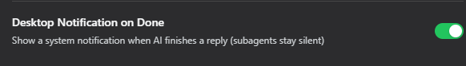

# dsh-desktop-notify

English | [简体中文](./README.md)

Desktop notification plugin for dsh: get a native OS notification the moment the AI finishes its reply, so you can safely switch away.

## Features

- Native desktop notification when a reply completes, with a preview of the reply text plus the workspace / session label
- Toggle in dsh Settings → General → **Desktop Notification on Done** (follows current UI language)
- Subagent background tasks stay silent — only the main conversation notifies
- Fan the done event out to **many devices** over HTTP (phone, other PCs), each configured independently, add/remove as you like

## HTTP Push (HTTP Call)

Want an "AI is done" nudge on another device while you're away from the computer? Turn on the HTTP-call push:

1. Set up any service that accepts an HTTP POST (self-hosted or compatible) and grab its endpoint URL and an optional access token.
2. In dsh Settings → General → **Desktop Notification on Done**, turn it on; the **HTTP Call** row appears below it — flip that on.
3. Hit **Add device** to add a device, fill in its name, server URL and access token; keep adding more — each device can be toggled or removed independently.
4. When you step away, every completed reply POSTs a JSON `{ "title", "body", "token", "icon" }` to **every enabled device with a server URL**.

> Desktop notification and HTTP call are two independent channels: enable either, or both.
> Devices are sent to in parallel; a failure on one never blocks the others.
> The access token is stored locally in `~/.dsh/desktop-notify.json` and is only sent to the server URLs you provide.
> Each device's **Icon URL** defaults to the bundled character image (`assets/dsh-icon.jpg`); leave it empty to omit the `icon` field entirely, set any image URL, or hit **Reset to default** to restore it.

## Screenshot



## Install

You must install the latest release **v1.4.1** (currently the latest); pin the version explicitly:

```bash
dsh plugin --profile web add dsh-desktop-notify@1.4.1
```

> Always include the `@1.4.1` version tag to be sure you get this latest release; using the bare package name installs `latest` and cannot guarantee 1.4.1.

Restart `dsh web` to activate.

## Uninstall

```bash
dsh plugin --profile web rm dsh-desktop-notify
```

## Contact

Questions or suggestions? Feel free to reach out:

- Email: crazy_l118@icloud.com

## Sponsor

If this plugin helped you, consider buying me a ham sausage for dinner 🌭


## Disclaimer

- This project is **not affiliated with, endorsed by, or sponsored by DeepSeek**.
- "DeepSeek Harness" is a registered trademark of DeepSeek; it is referenced here descriptively. The plugin name uses the officially recommended DSH abbreviation.
- When **HTTP Call** is enabled, notification content (title and reply preview) is transmitted to the push service you configure; the choice of service is entirely yours.

## License

MIT
